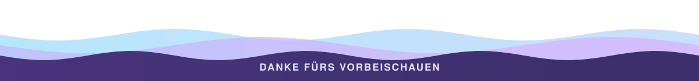

<!-- Die Grafiken in assets/ sind animierte SVGs aus tools/make_assets.py – ohne fremde Dienste, scharf auf jedem
     Bildschirm. Die Schlange zeichnet .github/workflows/snake.yml jede Nacht neu (Branch "output"). -->

  

  

  
  
  

## ☁️ Hey!

Hier wohnt **WolkeWeb** – eine kleine Werkstatt für Software, die man **selbst betreibt, selbst versteht und selbst in der Hand behält**.
Keine fremde Cloud, keine Blackbox: Die meisten Projekte laufen (noch) privat auf dem eigenen Server. Das hier ist der Blick durchs Werkstattfenster.

  

## 🛠️ Werkstatt

  

## 🧰 Werkzeugkasten

  

  Außerdem gern dabei: <b>pygame-ce</b> & <b>NumPy</b> für Spiele, <b>AES-GCM</b>, <b>PBKDF2</b> & <b>WebAuthn</b> für Zero-Knowledge, <b>pandas</b> & <b>scikit-learn</b> für Daten.

## 🐍 Aktivität

  <picture>
    <source media="(prefers-color-scheme: dark)" srcset="https://raw.githubusercontent.com/WolkeWeb/WolkeWeb/output/snake-dark.svg">
    <source media="(prefers-color-scheme: light)" srcset="https://raw.githubusercontent.com/WolkeWeb/WolkeWeb/output/snake.svg">
    
  </picture>

  

